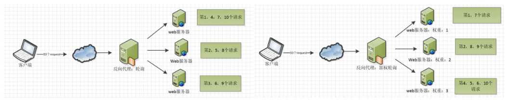
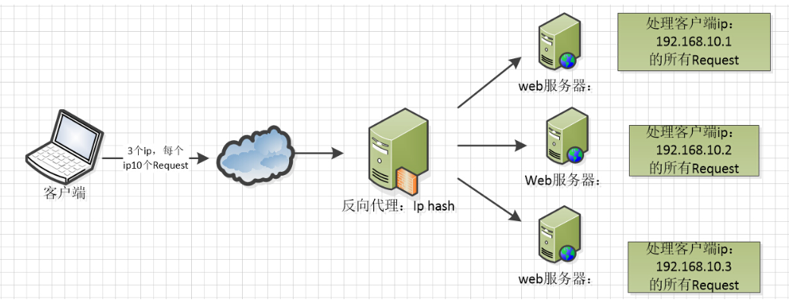
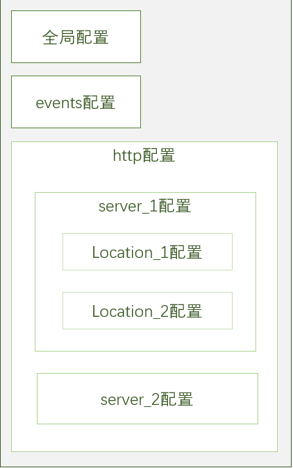

## Nginx

- HTTP 代理
  - 正向代理：为客户端代理
  - 反向代理：为服务端代理
    <div>
    
    </div>
- 负载均衡
  - 内置策略：轮询，加权轮询，ip hash
  - 拓展策略
    <div>
    
    
    </div>
- web 缓存

  - 校验缓存是否过期

    ```
    Expires
    Cache-Control
    E-tag
    Last-Modified
    ```

  - 设置缓存
    ```
    expires 24h;
    # 默认off，不缓存
    # 支持http,server,location块
    ```

- 解决跨域

  - ```
    add_header name value
    # value 默认 --
    # 支持http,server,location块
    ```

  - ```
    location ~ .*\.json$ {
      add_header Access-Control-Allow-Origin http://localhost:8080;
      add_header Access-Control-Allow-Methods GET,POST;
      root /data/json;
    }
    ```

- CDN
  - content delivery network 内容分发网络
  - 实时根据网络流量，各节点的连接，负载情况，传输距离和响应时间等综合信息重定向用户请求到最近的服务节点，解决网络拥堵状况，加快网站访问速度
    <div>
      
    </div>

## 配置文件

- 配置结构
  <div>
  </div>
- 全局块

  - <details>
    <summary>服务器用户（组）</summary>

    ```
    user userName [group]
    # userName 指定用户，默认 nobody
    # group 指定用户组，默认 nobody
    ```

    </details>

  - <details>
    <summary>最大worker_processes数</summary>

    ```
    worker_processes num | auto
    # num 默认1
    # auto 自动检测
    # 实现并发处理服务的关键
    ```

    </details>

  - <details>
    <summary>Nginx 进程运行文件存放路径</summary>

    ```
    pid file
    # file 存放路径或文件名称，默认 logs/nginx.pid
    ```

    </details>

  - <details>
    <summary>错误日志存放路径</summary>

    ```
    error_log file [stderr]
    # file 日志输出目标文件
    # stderr 日志级别 debug|info|notice|warn|error|crit|alert|emerg
    # 可以在http块，server块里配置
    ```

    </details>

  - <details>
    <summary>其他配置文件引入</summary>

    ```
    include file
    ```

    </details>

- events 块

  - <details>
    <summary>设置网络连接的序列化</summary>

    ```
    accept_mutex on|off
    # 默认on，防止多个进程争抢连接，即惊群现象
    ```

    </details>

  - <details>
    <summary>是否允许网络多连接</summary>

    ```
    multi_accept on|off
    # 默认off，每个worker_process 一次只能接受一个新的网络连接
    ```

    </details>

  - <details>
    <summary>事件驱动模型选择</summary>

    ```
    use model
    # model: select|poll|kqueue|epoll|resig|/dev/poll|eventport
    ```

    </details>

  - <details>
    <summary>最大连接数配置</summary>

    ```
    worker_connections num
    # num 默认512，表每个worker_process的最大连接数
    ```

    </details>

- http 块

  - <details>
    <summary>定义网络资源的媒体类型</summary>

    ```
    include mime.types
    # mime.types 文件扩展名与文件类型映射表

    default_type application/octet-stream
    # 默认文件类型, 字节流
    ```

    </details>

  - <details>
    <summary>自定义服务日志</summary>

    ```
    log_format FormatName FormatStr
    # FormatName 自定义格式命名
    # FormatStr 自定义格式，可由以下字段组成
    ## $remote_addr和$http_x_forwarded_for 客户端Ip
    ## $remote_user 客户端用户名称
    ## $time_local 访问时间与时区
    ## $request 请求url和http协议
    ## $status 请求状态
    ## $body_byte_sent 发送给客户端的文件主体内容大小
    ## $http_referer 页面访问链接
    ## $http_user_agent 客户端浏览器的相关信息
    ```

    ```
    access_log path/name [fromat] | off
    # path/name 自定义路径+名称
    # fromat 自定义格式，可配合log_format
    # off 取消服务日志
    ```

    </details>

  - <details>
    <summary>配置 sendfile</summary>

    ```
    sendfile on | off
    # 默认off
    # 开启时表不经过用户内核发送文件

    sendfile_max_chunk size
    # size 调用sendfile()传输数据的大小上限，默认0，表示不限制
    #支持 location，server 块
    ```

    </details>

  - <details>
    <summary>配置 tcp</summary>

    ```
    tcp_nopush on | off
    # 默认off，实时响应网络包
    # 在sendfile的前提下，开启时提高网络包传输效率
    #支持 location，server 块
    ```

    ```
    tcp_nodelay on | off
    # 默认on，与tcp_nopush互斥
    # 在keepalive连接下，提高网络包传输实时性
    ```

    </details>

  - <details>
    <summary>gzip</summary>

    ```
    gzip on | off
    # 默认off
    # 开启时可以节约带宽和提高网络传输效率

    gzip_comp_level num
    # num 压缩比率，默认1，最大9

    #支持 location，server 块
    ```

    </details>

  - <details>
    <summary>设置连接超时</summary>

    ```
    keepalive_timeout timeout [header_timeout]
    # timeout 服务端保持连接的时间，默认75秒
    # header_timeout 在响应报文头Keep-Alive 域设置超时时间 "Keep-Alive : timeout = header_timeout"
    ```

    </details>

  - <details>
    <summary>单连接请求数上限</summary>

    ```
    keepalive_requests num
    # 设置单链接的请求上限次数
    ```

    </details>

- server 块

  - <details>
    <summary>配置网络监听</summary>

    ```
    listen ip[:port] | port
    # ip:port 监听指定ip和port的连接
    # ip 监听指定ip所有端口的连接
    # port 监听指定端口所有ip的连接
    ```

    </details>

  - <details>
    <summary>虚拟主机配置</summary>

    ```
    server_name name1 name2...
    server_name ~^www\d+\.myserver\.com$
    server_name ip地址
    # 可以多个并列，支持正则和ip地址
    ```

    </details>

- location 块

  - <details>
    <summary>location 配置</summary>

    ```
    location [=|~|~*|^~] uri {...}
    # uri 标准uri或正则uri
    ```

    1. = 精确匹配模式

       精确匹配 uri 字符，不支持正则，区分大小写

       ```
       location = /example {...}
       # http://demo/example 匹配
       # http://demo/example/ 不匹配
       # http://demo/example$ 不匹配
       ```

    2. ^~ 前缀匹配模式
       只要匹配到 url 开头前缀与 uri 一样即停止，不支持正则，区分大小写

       ```
       location ^~ /example {...}
       # http://demo/example 匹配
       # http://demo/example/ 匹配
       # http://demo/example/AAB 匹配
       # http://demo/exampleAAB 匹配
       # http://demo/axample 不匹配
       ```

    3. ~[\*] 正则匹配模式  
       \*表示不区分大小写，可选

       ```
       location ~* /[a-z]xample {
         rewrite ^(.*)$ /aaa/$1 break;
         proxy_pass http://dxample.com;
        #proxy_pass http://dxample.com/aaa; 报错
       }
       # http://demo/example 匹配
       # http://demo/axample 匹配
       # http://demo/example/AAB 匹配，rewrite-> /aaa/example/AAB
       # http://demo/6xample 不匹配
       # 该模式下 proxy_pass 里只允许配置不带路径的ip或域名，如需配置路径需要配合rewrite使用
       ```

    4. 正常匹配模式
       不添加指令，可使用正则，不区分大小写，匹配模式同前缀模式，但优先级低于前缀匹配

    5. 匹配优先级
       精确匹配 > 前缀匹配 > 正则匹配 > 正常匹配

    </details>

  - <details>
    <summary>请求根目录</summary>

    ```
    root path
    # path 处理请求的查找资源根目录
    ```

    </details>

  - <details>
    <summary>更改URI</summary>

    ```
    alias path
    # 更改location接收到uri请求路径为path
    ```

    </details>

  - <details>
    <summary>网站默认首页</summary>

    ```
    index file file1 ...
    # 先找到哪个页面就用哪个
    ```

    </details>

- 负载均衡

  - <details>
      <summary>基本用法</summary>

    ```
    upstream mysvr {
        server ip1;
        server ip2;
        ...
    }
    server {
        location ~*^.+$ {
            proxy_pass http://mysvr;
            #重定向请求到mysvr定义的服务器列表
        }
    }
    ```

    </details>

  - <details>
     <summary>热备</summary>

    ```
    upstream mysvr {
        server ip1;
        server ip2 backup;
    }
    # ip1 服务器宕机时，才启用备用服务器 ip2
    ```

    </details>

  - <details>
     <summary>轮询，默认算法</summary>

    ```
    upstream mysvr {
        server ip1;
        server ip2;
    }
    # 默认权重都为1，处理请求顺序为121212...
    ```

    </details>

  - <details>
     <summary>加权轮询</summary>

    ```
    upstream mysvr {
        server ip1 weight=1;
        server ip2 weight=2;
    }
    # 根据服务器权重分发不同数量的请求，处理请求顺序为122122122...
    ```

    </details>

  - <details>
     <summary>ip_hash</summary>

    ```
    upstream mysvr {
        server ip1;
        server ip2;
        ip_hash;
    }
    # 相同的客户端ip请求相同的服务器
    ```

    </details>

  - <details>
     <summary>状态配置</summary>

    ```
    upstream mysvr {
        server ip1 down;
        server ip2 max_fails=2 fail_timeout=10s;
    }
    # down 当前服务器不参与负载均衡
    # max_fails 最大请求失败次数，默认为1，超出最大次数时返回proxy_next_upstream定义的错误
    # fail_timeout 经历max_fails 次失败后，暂停服务的时间
    ```

    </details>
